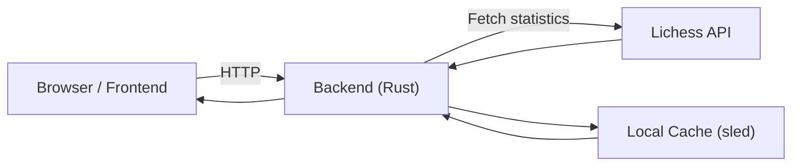

# vsLichessDB
A chess practice tool that lets you drill openings against the average Lichess player.  
Enter a FEN position to start from and have the AI play moves based on the likelihood that a real human would have played them.  
All data is gathered from the Lichess games database (hence the name) accessed through their API and cached for faster access.  

---

## Requirements to run locally  
- **Rust** for running the backend  
- **Node** and **pnpm** for bundling the frontend  

---

## How to install  
Clone the repo and then execute the following commands inside the project folder.  
`cd frontend`  
`pnpm install`  
`pnpm build` - Bundle frontend with Vite  
`pnpm dev` - Optional, for developing the frontend  
`cd ..`  
`cargo run`  - Run backend  

---

## How it works  
When considering the next move to play it uses the aggregated data from all past chess games on Lichess and chooses a move based on how frequently it has been played in real games in that position.  
  
For example:  
In the opening Evans Gambit after 4.b4, there are almost 6 million recorded games as of writing. The most popular move in that position is Bxb4, played around 5 million times. That means Bxb4 will be played by the AI with a probability of around 80%, whereas a move such as Bb6 is selected only 13% of the time, mirroring how the average opponent would play while giving you the advantage of practicing the openings of your choice.  
  
[WIP] The move generator can also be limited to only consider moves of the x% most popular moves.  

